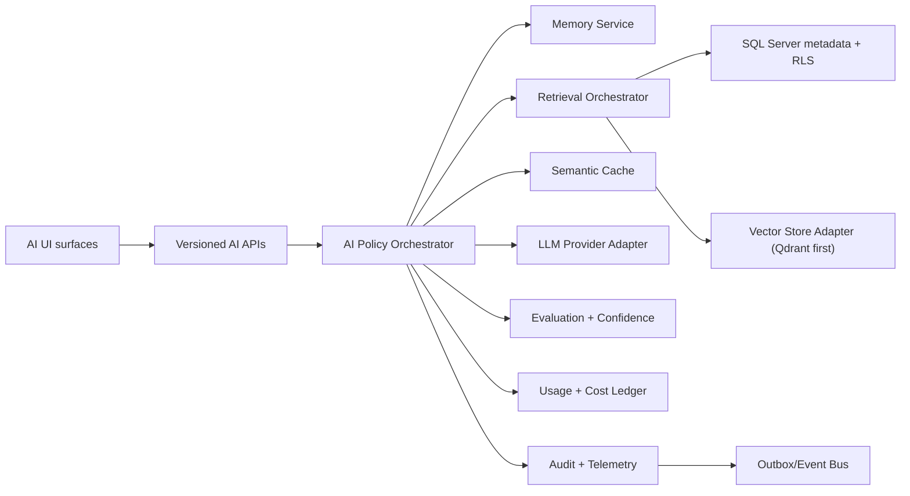

# Technical Design - Governed AI Platform

Feature Name: Governed AI Platform
Module: AI / Platform
Owner: Solution Architect
Created Date: 2026-06-27
Version: 1.0
Status: Approved

> Doc 2 of 5 required before implementation. Companion docs:
> FEAT-AI-001, DB-DESIGN-AI-001, UI-AI-001, TEST-AI-001.
> No AI implementation may start until all five documents are Approved.

---

# 1. Purpose

This document defines the technical design for the governed AI platform described in
`FEAT-AI-001-business-requirements.md` and exposed through the approved Phase 6D API
package.

The design must support enterprise HRMS use cases without weakening the core platform
rules: tenant isolation, RBAC, ABAC, audit, effective dating, event-driven integration,
OpenAPI documentation, and configuration-driven extension.

---

# 2. Approved Inputs

This design depends on the following approved decisions and documents:

- `ADR-006-tenant-context-data-access.md`
- `ADR-008-identity-access.md`
- `ADR-009-event-driven-backbone.md`
- `ADR-019-ai-rag-architecture.md`
- `ADR-022-data-retention-archival-legal-hold-deletion.md`
- `ADR-027-provider-abstraction-framework.md`
- `ADR-030-vector-store-strategy.md`
- `ADR-031-ai-observability-telemetry.md`
- `ADR-032-conversation-memory-strategy.md`
- `ADR-033-ai-cost-governance.md`
- `ADR-034-rag-evaluation-framework.md`
- `ADR-035-semantic-cache-architecture.md`
- `AI-OPS-001-enterprise-ai-operations.md`
- `AI-DR-001-disaster-recovery-and-exercise-plan.md`
- `SEC-AI-001-ai-security-extension.md`
- `API-SPEC-002-ai-platform-v1.md`
- `OPENAPI-002-ai-platform-v1.yaml`

If any of these inputs changes, this technical design must be reviewed before
implementation starts.

---

# 3. Design Goals

1. Provide cited, grounded AI answers for authorized HRMS users.
2. Keep AI provider, vector store, embedding model, prompt bundle, cache, and evaluation
   components replaceable through adapters and configuration.
3. Support synchronous, streaming, and batch AI request patterns with the same governance.
4. Support knowledge ingestion, validation, shadow indexing, publication, and rollback.
5. Deny unsafe memory, cache, retrieval, tool, or output behavior by default.
6. Preserve core HRMS usability when AI is degraded or disabled.
7. Allow future modules and AI use cases to be added without modifying existing core logic.

---

# 4. Architecture Summary

The AI platform is implemented as a bounded platform module inside the modular monolith,
with adapter boundaries for external providers and infrastructure.



The module is open for extension through registered adapters, policies, prompt versions,
retrieval strategies, knowledge connectors, and UI capabilities. Existing orchestration
contracts must remain stable unless a new ADR approves a breaking architectural change.

---

# 5. Core Components

| Component | Responsibility |
|---|---|
| AI API Controller | Accepts versioned API requests, validates envelopes, applies authentication, and calls application services. |
| AI Orchestrator | Coordinates policy, memory, cache, retrieval, model call, output validation, audit, telemetry, and cost ledger. |
| AI Policy Evaluator | Enforces tenant, purpose, use-case, safety, budget, rate limit, retention, and disablement policies. |
| Retrieval Orchestrator | Executes authorized RAG retrieval across approved indexes and read-only tools. |
| Vector Store Adapter | Abstracts Qdrant first and future Azure AI Search or other vector stores. |
| Embedding Provider Adapter | Abstracts embedding model provider and model version. |
| LLM Provider Adapter | Abstracts model/provider calls, streaming, retry, timeout, and error normalization. |
| Prompt Registry | Resolves approved prompt bundle versions by tenant, use case, locale, and lifecycle state. |
| Knowledge Ingestion Service | Validates sources, builds chunks, creates embeddings, writes shadow indexes, and requests publication. |
| Evaluation Service | Runs governed test suites and stores promotion evidence. |
| Conversation Memory Service | Applies SessionOnly default, optional summaries, purpose boundaries, invalidation, and reset behavior. |
| Semantic Cache Service | Applies deny-by-default cache eligibility, namespace isolation, reauthorization, and invalidation. |
| Usage Ledger Service | Records normalized usage, token estimates, provider calls, budget reservations, and cost evidence. |
| Operations Service | Handles health, disablement, DR exercise evidence, retention reconciliation, and namespace rotation. |

---

# 6. Required Interfaces

These interfaces define extension points. Implementations may vary, but callers must use
contracts rather than provider-specific code.

```csharp
public interface IAiOrchestrator
{
    Task<AiAnswerResult> AskAsync(AiAskCommand command, CancellationToken cancellationToken);
    IAsyncEnumerable<AiStreamEvent> AskStreamAsync(AiAskCommand command, CancellationToken cancellationToken);
    Task<AiBatchResult> ExecuteBatchAsync(AiBatchCommand command, CancellationToken cancellationToken);
}

public interface ILlmProvider
{
    Task<LlmCompletionResult> CompleteAsync(LlmCompletionRequest request, CancellationToken cancellationToken);
    IAsyncEnumerable<LlmStreamDelta> StreamAsync(LlmCompletionRequest request, CancellationToken cancellationToken);
}

public interface IEmbeddingProvider
{
    Task<EmbeddingResult> EmbedAsync(EmbeddingRequest request, CancellationToken cancellationToken);
}

public interface IVectorStore
{
    Task<VectorSearchResult> SearchAsync(VectorSearchRequest request, CancellationToken cancellationToken);
    Task UpsertAsync(VectorUpsertBatch batch, CancellationToken cancellationToken);
    Task PromoteAliasAsync(VectorAliasPromotion request, CancellationToken cancellationToken);
}

public interface IAiPolicyEvaluator
{
    Task<AiPolicyDecision> EvaluateAsync(AiPolicyContext context, CancellationToken cancellationToken);
}

public interface IReadOnlyTool
{
    Task<ToolResult> ExecuteAsync(ToolRequest request, CancellationToken cancellationToken);
}
```

Contracts must be tenant-aware, correlation-aware, idempotency-aware, and cancellation-aware.
Provider adapters cannot bypass policy, audit, telemetry, budget, or tenant controls.

---

# 7. Request Flows

## 7.1 Synchronous Ask Flow

1. API resolves authenticated user and server-side tenant context.
2. API validates request purpose, use case, locale, and idempotency key where applicable.
3. Policy evaluator checks disablement, budget, quotas, rate limits, safety, and purpose.
4. Memory service builds eligible context according to ADR-032.
5. Semantic cache checks eligibility. Personalized HR/payroll requests are deny-by-default.
6. Retrieval orchestrator searches only approved, tenant-authorized sources.
7. LLM provider generates response using approved prompt bundle and model assignment.
8. Output validator checks citations, unsupported claims, sensitivity, and refusal rules.
9. Confidence evaluator attaches confidence and escalation recommendation.
10. Audit, telemetry, cost ledger, and events are recorded.

## 7.2 Streaming Flow

Streaming uses Server-Sent Events for request/response interaction.

Required event sequence:

- `ai.started`
- zero or more `ai.delta`
- zero or more `ai.citation`
- optional `ai.confidence`
- optional `ai.warning`
- exactly one terminal event: `ai.completed`, `ai.error`, or `ai.cancelled`

Rules:

- Authorization and policy checks happen before the first content delta.
- Partial output must pass streaming-safe output filters before release.
- Final citations and audit reference must be emitted before completion.
- Client cancellation records `AiStreamCancelled`.
- Streaming cannot expose hidden system prompts, provider traces, raw tool output, or
  unauthorized citations.

## 7.3 Batch Flow

Batch requests are collections of independent AI requests.

Rules:

- Maximum batch size is governed by tenant/use-case policy.
- Each item is independently validated, authorized, metered, audited, and rate-limited.
- Partial success is allowed.
- One failed item cannot leak data to another item.
- Idempotency applies per batch and per item.
- Response ordering must match request ordering.

## 7.4 Knowledge Ingestion Flow

1. Register source metadata.
2. Upload or link source version through approved storage controls.
3. Validate file type, malware status, classification, hidden text, prompt injection,
   retention eligibility, ownership, and metadata.
4. Chunk content using configured strategy.
5. Generate embeddings using configured embedding provider.
6. Write vectors into a shadow namespace/index.
7. Run retrieval quality, isolation, citation, and poisoning tests.
8. Publish by alias promotion only after approval.
9. Emit ingestion, validation, publication, and rollback events.

## 7.5 Evaluation and Promotion Flow

AI production changes are promoted as versioned bundles containing model assignment,
prompt versions, retrieval configuration, safety policy, memory policy, cache policy, and
knowledge index references.

Lifecycle:

`Draft -> Evaluation -> Approved -> Canary -> Production -> Deprecated -> Retired`

Every promotion requires stored evaluation evidence, risk-owner approval where applicable,
rollback target, and audit trail.

---

# 8. Security Design

Security controls are applied in layers:

- JWT authentication and server-side tenant resolution.
- RBAC and ABAC checks on every API and object.
- SQL Server RLS for tenant-scoped metadata.
- Vector namespace and payload filtering per tenant/security scope.
- Per-turn reauthorization for memory, retrieval, cache, and tools.
- Prompt injection and RAG poisoning detection during ingestion and request execution.
- Provider credentials stored as secret references, never as API-visible values.
- Output filtering before synchronous, streaming, batch, cached, or tool-backed responses.
- Full audit for user request, system decision, source usage, provider call, and output.

AI services must fail closed for security, tenant-isolation, authorization, and retention
uncertainty. They may fail open only by refusing AI output while preserving non-AI HRMS
operations.

---

# 9. Tenant Isolation

Tenant isolation is enforced at:

- API context: tenant comes from authenticated context, not request body.
- SQL Server: every tenant table has `TenantId`, RLS, tenant index, and audit columns.
- Vector store: tenant partitioning uses Qdrant collection/partition strategy approved by
  ADR-030.
- Cache: namespace includes tenant, use case, policy version, model version, and index
  version.
- Events: every AI event includes tenant and correlation identifiers.
- Telemetry: high-cardinality or sensitive values are redacted or tokenized.

Cross-tenant test cases are mandatory before approval.

---

# 10. Data and Storage Design

| Data Type | System of Record |
|---|---|
| AI conversations and summaries | SQL Server `AI` schema |
| Knowledge metadata and source versions | SQL Server metadata + approved object storage |
| Vector embeddings | Qdrant first, through `IVectorStore` |
| Prompt/model/policy versions | SQL Server effective-dated configuration tables |
| Usage and cost evidence | SQL Server usage ledger |
| Short-term session context | Redis where enabled |
| Semantic cache | Redis where eligible |
| Audit trail | Platform audit schema plus AI-specific references |

Raw vector payloads, raw system prompts, provider secrets, and unrestricted conversation
memory must not be exposed through product APIs.

---

# 11. Event Design

AI events must use the platform outbox/event backbone. Events are immutable, tenant-scoped,
correlation-scoped, and replay-safe.

Required events:

- `AiConversationStarted`
- `AiMessageSubmitted`
- `AiAnswerGenerated`
- `AiAnswerRefused`
- `AiStreamStarted`
- `AiStreamCompleted`
- `AiStreamCancelled`
- `AiBatchRequested`
- `AiBatchItemCompleted`
- `AiKnowledgeSourceRegistered`
- `AiKnowledgeSourceValidated`
- `AiKnowledgeIndexBuilt`
- `AiKnowledgeSourcePublished`
- `AiEvaluationRunCompleted`
- `AiBundlePromoted`
- `AiBudgetReserved`
- `AiBudgetExceeded`
- `AiOperationalDisablementChanged`
- `AiRetentionReconciliationCompleted`
- `AiDrExerciseCompleted`

Downstream consumers must not treat events as authorization proof. Consumers must re-check
tenant and permission where data access occurs.

---

# 12. Observability and Operations

Required telemetry:

- Request latency, streaming time to first token, completion latency, and cancellation rate.
- Retrieval latency, source count, citation count, and unsupported claim rate.
- Model/provider latency, error rate, retry count, timeout count, and provider behavior drift.
- Token usage, avoided provider calls, cache value score, and cost per successful request.
- Hallucination rate, hallucination severity, confidence distribution, escalation rate.
- Tenant isolation, authorization denial, prompt-injection, and poisoning signals.

Dashboards and alerts follow ADR-031 and AI-OPS-001. Logs must not contain raw prompts with
sensitive HR data unless explicitly classified and protected by policy.

---

# 13. Degraded Modes

| Failure | Required Behavior |
|---|---|
| LLM provider unavailable | AI answer fails gracefully; core HRMS remains usable; provider fallback only if policy-approved. |
| Qdrant unavailable | RAG answers fail closed or use approved degraded mode; no uncited generated answer. |
| Redis unavailable | Session memory/cache disabled; request continues only if safe without Redis. |
| Evaluation service unavailable | Promotions blocked; normal approved production bundle continues. |
| Budget service unavailable | Paid provider calls fail closed unless emergency override is approved. |
| Audit unavailable | Mutating/governed AI operations fail closed. |

---

# 14. API and OpenAPI Requirements

All implementation must match:

- `API-SPEC-002-ai-platform-v1.md`
- `OPENAPI-002-ai-platform-v1.yaml`

OpenAPI updates are mandatory for any endpoint, schema, response, error, header, or event
contract change. API versioning and deprecation follow the approved API specification.

---

# 15. Extension Model

Future modules and providers must be added by registration, configuration, and adapters.

Supported extension points:

- LLM provider adapter.
- Embedding provider adapter.
- Vector store adapter.
- Read-only tool connector.
- Knowledge source connector.
- Prompt bundle.
- Retrieval strategy.
- Chunking strategy.
- Safety policy.
- Evaluation dataset and metric.
- UI capability registration.
- Tenant feature flag.

Core orchestration cannot be forked for customer-specific behavior.

---

# 16. Non-Goals

- Building autonomous agents.
- Allowing AI to directly approve, reject, update, or delete HRMS business records.
- Storing unrestricted long-term user profiles.
- Using Azure AI Search as the initial mandatory vector store.
- Hardcoding HR, payroll, leave, compliance, or workflow rules in AI code.

---

# 17. Acceptance Criteria

| ID | Criterion |
|---|---|
| TECH-AI-AC-001 | All AI request paths pass through the AI Orchestrator and AI Policy Evaluator. |
| TECH-AI-AC-002 | LLM, embedding, vector store, cache, and retrieval implementations are accessed only through provider-neutral interfaces. |
| TECH-AI-AC-003 | Streaming responses use approved SSE event types and preserve audit, citation, confidence, and cancellation behavior. |
| TECH-AI-AC-004 | Batch execution applies independent authorization, validation, audit, citation, confidence, idempotency, and rate-limit behavior per item. |
| TECH-AI-AC-005 | Knowledge publication uses validation, shadow index, evaluation evidence, approval, alias promotion, and rollback. |
| TECH-AI-AC-006 | Tenant isolation is enforced at API, SQL, vector, cache, event, telemetry, and UI boundaries. |
| TECH-AI-AC-007 | AI degraded modes preserve core HRMS availability and fail closed for unsafe AI output. |
| TECH-AI-AC-008 | All AI behavior-changing configuration is versioned, auditable, and reversible. |
| TECH-AI-AC-009 | No customer-specific AI behavior requires core code modification. |
| TECH-AI-AC-010 | OpenAPI remains the contract source for every AI endpoint. |

---

# 18. Official and Primary References

- OpenAPI Specification v3.0.3:
  `https://spec.openapis.org/oas/v3.0.3.html`
- WHATWG Server-Sent Events:
  `https://html.spec.whatwg.org/multipage/server-sent-events.html#server-sent-events`
- OWASP Top 10 for LLM and Generative AI Applications 2025:
  `https://genai.owasp.org/llm-top-10/`
- OWASP API Security Top 10 2023:
  `https://owasp.org/API-Security/editions/2023/en/0x11-t10/`
- NIST AI Risk Management Framework:
  `https://www.nist.gov/itl/ai-risk-management-framework`
- Qdrant multitenancy documentation:
  `https://qdrant.tech/documentation/manage-data/multitenancy/`
- Redis Cluster documentation:
  `https://redis.io/docs/latest/operate/oss_and_stack/management/scaling/`

References last validated: 2026-06-27.

---

# Approval

Product Owner: Approved by Bhajan Lal 2026-06-27  
Solution Architect: Approved as part of owner-approved AI implementation package 2026-06-27  
Security Architect: Approved as part of owner-approved AI implementation package 2026-06-27  
Data Governance/Privacy: Approved as part of owner-approved AI implementation package 2026-06-27  
Platform/Operations Architect: Approved as part of owner-approved AI implementation package 2026-06-27  
QA Architect: Approved as part of owner-approved AI implementation package 2026-06-27

(Status: Approved - owner approved 2026-06-27)
