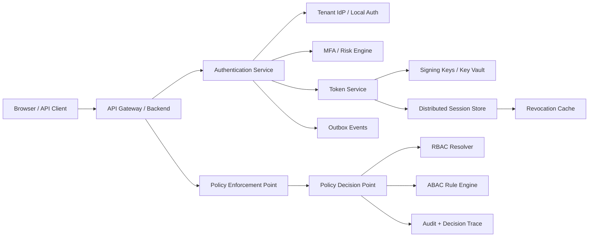
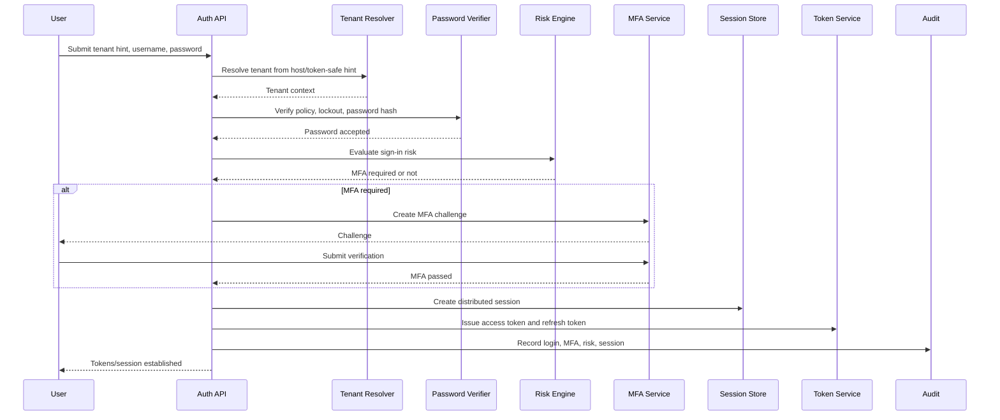
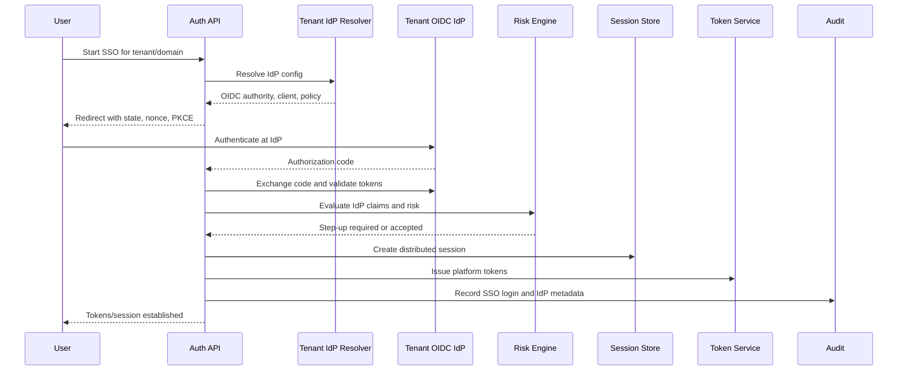
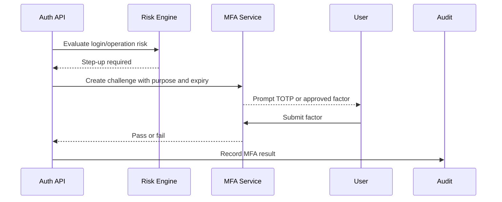
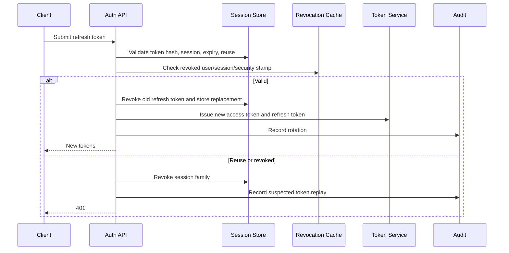
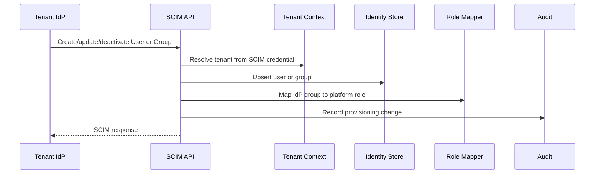
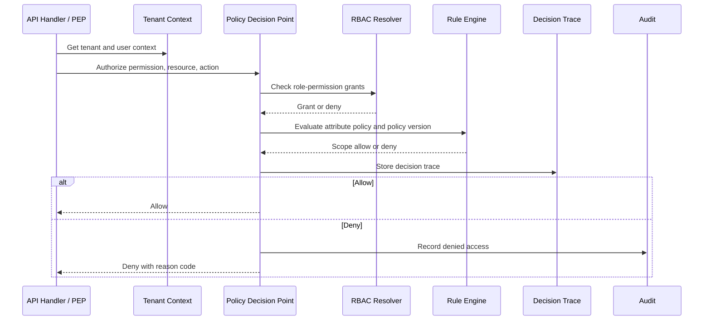
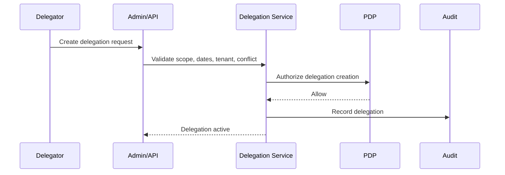
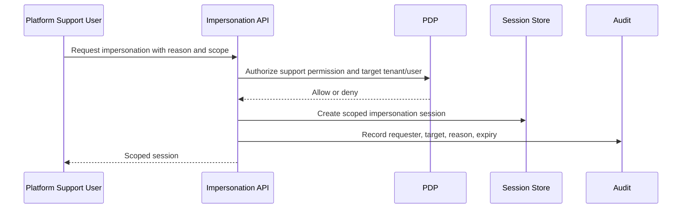
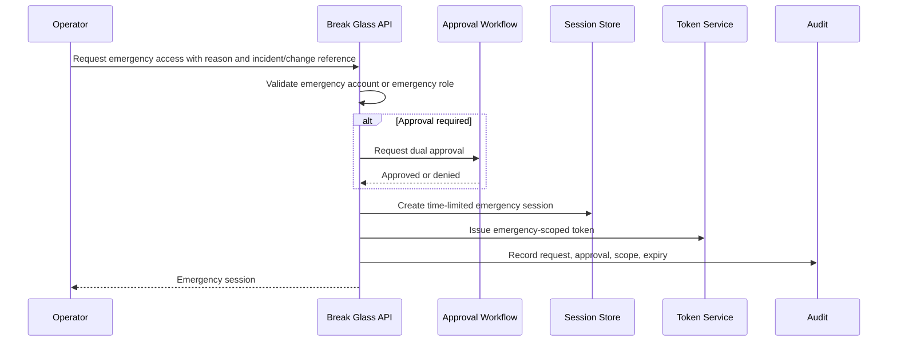

# Technical Design - Identity, Authentication, RBAC, and ABAC

Feature Name: Identity and Access
Requirement ID: FR-002
Module: Platform / Security
Owner: Security Architect / .NET Architect
Created Date: 2026-06-14
Last Updated: 2026-06-28
Version: 1.1
Status: Approved

> Doc 2 of 5 required before implementation. Companion docs:
> FEAT-IDENTITY-001, DB-DESIGN-IDENTITY-001, UI-IDENTITY-001, TEST-IDENTITY-001.
> No Identity, Authentication, RBAC, or ABAC implementation may start until all five
> documents are Approved.

---

# 1. Purpose

This document defines the technical design for Identity and Access Management in the HRMS
platform. It implements ADR-008, the approved Identity database design, the platform
security model, and the enhanced business requirements in FEAT-IDENTITY-001.

The design covers:

- Local authentication.
- OIDC/SSO authentication.
- MFA and adaptive risk-based MFA.
- JWT access tokens and rotating refresh tokens.
- Distributed sessions and token revocation.
- SCIM provisioning.
- RBAC and ABAC authorization through central PEP/PDP.
- Delegation and impersonation.
- Break-glass emergency access.
- Audit, observability, and authorization decision traceability.

---

# 2. Approved Inputs

Required inputs:

- `FEAT-IDENTITY-001-business-requirements.md`
- `DB-DESIGN-IDENTITY-001.md`
- `ADR-006-tenant-context-data-access.md`
- `ADR-008-identity-access.md`
- `ADR-011-rule-engine-expression-language.md`
- `SEC-DESIGN-001-threat-model.md`
- `API-SPEC-001-foundational.md`
- `OPENAPI-001-foundational-v1.yaml`
- `SECURITY_STANDARDS.md`
- `API_STANDARDS.md`

Identity implementation must also depend on the already-approved Tenant Catalog + RLS
foundation for trusted tenant context.

---

# 3. Architecture Summary

All product modules call the central identity and authorization services. Inline role
string checks, module-specific authorization logic, and ungoverned direct permission checks
are prohibited.

---

# 4. Core Components

| Component | Responsibility |
|---|---|
| Authentication Service | Coordinates local login, OIDC login, MFA, risk checks, break-glass login, and token issuance. |
| Tenant IdP Resolver | Resolves tenant-specific OIDC provider configuration through the Tenant Catalog. |
| Password Verifier | Validates local password policy, compromised-password rules, lockout state, and BCrypt password hash. |
| Risk Engine | Evaluates sign-in and operation risk signals for adaptive MFA and lockout controls. |
| MFA Service | Handles TOTP and future pluggable MFA methods. |
| Token Service | Issues JWT access tokens and rotating refresh tokens. |
| Signing Key Manager | Manages signing key references, public key publication, rollover, and emergency revocation. |
| Distributed Session Service | Stores sessions, device metadata, revocation state, and forced-logout state across app instances. |
| SCIM Provisioning Service | Handles SCIM user/group provisioning and deprovisioning. |
| PEP | Enforces authorization at API, handler, job, and UI capability boundaries. |
| PDP | Computes authorization decisions using RBAC, ABAC, tenant context, delegation, and policy version. |
| Delegation Service | Evaluates scoped, time-boxed delegated access. |
| Impersonation Service | Manages scoped platform support sessions with explicit audit. |
| Break Glass Service | Handles emergency authentication, approval, token/session scope, expiry, and audit. |
| Authorization Decision Trace | Captures allow/deny evidence for support, audit, and security investigations. |

---

# 5. Authentication Flows

## 5.1 Local Authentication

Rules:

- Tenant context is resolved server-side.
- Password verification includes policy, lockout, and compromised-password checks.
- MFA and step-up decisions are risk-aware.
- Login emits audit and security telemetry.

## 5.2 OIDC / SSO Authentication

Rules:

- Authorization Code with PKCE is required for browser-based SSO.
- `state`, `nonce`, issuer, audience, signature, token lifetime, and tenant binding are
  validated.
- IdP claims do not replace server-side ABAC attributes.
- Local fallback is controlled by tenant policy.

## 5.3 MFA Challenge Flow

MFA challenge state is short-lived, purpose-bound, and cannot be reused across operations.

## 5.4 Refresh Token Rotation

Refresh tokens are stored hashed. Reuse detection revokes the token family and raises a
security event.

## 5.5 SCIM User Provisioning

SCIM credentials are tenant-scoped. Deprovisioning disables access and revokes sessions.

---

# 6. Authorization Flows

## 6.1 PEP to PDP Authorization Decision

Authorization is deny-by-default. Every object access must include tenant, permission,
resource, operation, and ABAC scope.

## 6.2 Delegation Flow

Delegated actions are scope-limited, time-limited, tenant-scoped, and recorded with
`OnBehalfOf`.

## 6.3 Impersonation Flow

Impersonation is never silent and must be visible in audit. The impersonated user identity,
support user identity, reason, scope, and expiry are preserved.

---

# 7. Break Glass Authentication Flow

Break-glass access is a separate emergency path for identity provider outage,
administrator lockout, disaster recovery, or critical security incidents. It is isolated
from ordinary tenant authentication and ordinary administrator assignment.

Rules:

- Emergency accounts or roles are dedicated, separately monitored, and disabled from normal
  day-to-day administration.
- Emergency sessions are short-lived, non-renewable unless a new emergency workflow is
  approved, and automatically expire.
- Business reason and incident/change reference are mandatory.
- Highly privileged scopes may require maker-checker approval.
- Break-glass tokens have an explicit emergency purpose claim and reduced lifetime.
- Break-glass does not bypass tenant isolation, RLS, audit, or object-level authorization.
- All authentication, authorization decisions, and administrative actions during the
  session are linked to the emergency access record.
- Emergency access can never grant a permanent role assignment.

---

# 8. JWT Signing and Key Management

## 8.1 Signing Algorithm

Platform-issued JWT access tokens use asymmetric signing. Default algorithm:

- `RS256` for initial implementation.
- `ES256` may be adopted later through approved cryptographic review.
- Symmetric `HS*` algorithms are not allowed for platform-issued access tokens.
- The accepted algorithm list is configured server-side and never inferred only from the
  token header.

JWT validation must verify issuer, audience, subject, expiry, not-before, token type,
tenant binding, key ID, and signature. ABAC attributes are resolved server-side and are not
trusted only from JWT claims.

## 8.2 Private Key Storage

Private signing keys are stored in Azure Key Vault, HSM-backed Key Vault, or equivalent
approved key-management service. Application services receive key references and signing
capability through controlled access; private key material is not stored in source code,
configuration files, database rows, logs, or application memory dumps.

## 8.3 Public Key Distribution

Public signing keys are published through a JWKS endpoint or equivalent internal discovery
endpoint. Each token includes `kid`. Validators use `kid` to select the correct public key.

Requirements:

- JWKS responses are cacheable with short TTL.
- Validators refresh keys on unknown `kid`.
- Validators continue to accept old active keys during planned rollover.
- Disabled or revoked keys are removed from validation after the emergency revocation
  policy takes effect.

## 8.4 Key Rotation

Planned rotation:

1. Create a new signing key version.
2. Publish new public key to JWKS.
3. Start signing new tokens with the new key.
4. Continue validating tokens signed with the previous active key until token expiry and
   grace period complete.
5. Disable old key after validation window closes.

Emergency revocation:

- Mark key as compromised.
- Stop signing with the compromised key.
- Remove or disable validation for the compromised key according to incident response
  decision.
- Revoke affected sessions and refresh token families where required.
- Emit security event and audit evidence.

---

# 9. Distributed Session and Token Revocation Architecture

The platform runs across multiple application instances, so session and token state must be
shared.

## 9.1 Stores

| Store | Purpose |
|---|---|
| SQL Server `security.Session` | Durable session metadata, device info, revocation, expiry, user security stamp. |
| SQL Server `security.RefreshToken` | Hashed refresh tokens, rotation family, expiry, revocation, replacement token link. |
| Redis revocation cache | Fast cluster-wide lookup for revoked sessions, users, tenants, token families, and security stamps. |
| Event bus/outbox | Propagates logout, forced logout, role change, tenant suspension, and emergency revocation events. |

## 9.2 Revocation Rules

- Logout revokes the current session and refresh token family.
- Global logout revokes all active sessions for the user within the tenant.
- Tenant suspension revokes or blocks all sessions for that tenant.
- Role, permission, ABAC policy, or risk changes update a user security stamp and force
  reauthorization.
- Refresh token reuse detection revokes the token family and session.
- Break-glass session expiry is enforced through both durable session state and revocation
  cache.

## 9.3 Cluster-Wide Propagation

Each application instance must check:

- Access token signature and claims.
- User/session/tenant revocation state from local short TTL cache backed by Redis.
- Security stamp or session version for high-risk APIs.
- Authorization policy version where relevant.

Revocation events:

- `UserSessionRevoked`
- `UserGlobalLogoutRequested`
- `RefreshTokenReuseDetected`
- `TenantSessionsRevoked`
- `RoleAssignmentChanged`
- `PermissionChanged`
- `AbacPolicyChanged`
- `BreakGlassSessionExpired`
- `SigningKeyRevoked`

No application instance may rely only on in-memory revocation state.

---

# 10. Authorization Decision Traceability

Every authorization decision must create diagnostic evidence sufficient for support,
security investigation, compliance, and audit without exposing sensitive internal rule
details.

Required decision trace fields:

- Tenant identifier.
- User identifier.
- Subject type: user, delegate, impersonator, break-glass operator, or system.
- Requested permission.
- Resource type and resource identifier where applicable.
- Requested operation.
- Evaluated RBAC role grants.
- Evaluated ABAC policy reference.
- ABAC policy version.
- Delegation or impersonation reference where applicable.
- Decision: Allow or Deny.
- Decision reason code.
- Correlation ID.
- Request ID.
- Decision timestamp.

Protected fields:

- Raw rule expressions.
- Sensitive ABAC attribute values.
- Secrets.
- Provider tokens.
- Password/MFA material.

Decision traces are separate from full audit records but linked by correlation ID and audit
reference. Denials for sensitive resources and all privileged decisions must be retained
according to the security audit policy.

---

# 11. Password, Lockout, and Adaptive MFA Controls

The technical design implements FEAT-IDENTITY-001 enterprise controls:

- Tenant-configurable password policy within platform minimums.
- Compromised/common password prevention.
- Password reset verification.
- Failed login counters by user, tenant, IP/network, device, and risk signal.
- Temporary lockout and progressive retry delay.
- Authentication endpoint rate limiting.
- Optional challenge after suspicious behavior.
- Adaptive MFA for risk signals and sensitive operations.

Lockout controls must not allow easy denial-of-service against users. Risk scoring and
progressive delays should be preferred before long lockout where policy allows.

---

# 12. SCIM Provisioning

SCIM 2.0 endpoints support tenant-scoped user and group provisioning.

Rules:

- SCIM credentials are tenant-scoped and rotated.
- IdP group to role mapping is tenant configuration.
- Deprovisioning disables users and revokes sessions.
- Group removal updates role assignments and user security stamp.
- SCIM changes emit audit events and authorization-cache invalidation events.
- SCIM never grants permissions that do not exist in the global permission catalog.

---

# 13. Integration Rules

All platform modules consume identity through shared contracts:

- `ICurrentUser`
- `ITenantContext`
- `IBranchScopeResolver`
- `IAuthorizationService`
- `IPolicyDecisionPoint`
- `ISessionService`
- `IAuditContext`

Rules:

- Endpoints declare required permission and ABAC scope.
- Branch/office scope from `TECH-BRANCH-001` is evaluated as an ABAC boundary after tenant
  context and before module access.
- Application services call authorization before data access for protected operations.
- Repositories still rely on tenant isolation from FR-015.
- No module may perform inline role string checks as the final authorization decision.
- OpenAPI must document authentication, authorization, error responses, and session APIs.

---

# 14. Observability and Audit

Auth telemetry:

- Login success/failure.
- MFA challenge/pass/fail.
- OIDC callback failure.
- Refresh rotation success/failure.
- Refresh token reuse detection.
- Lockout and unlock.
- Session revoke/global logout.
- Break-glass request, approval, use, expiry.
- Authorization allow/deny counts.
- Policy evaluation latency.
- SCIM provisioning events.

Security alerts:

- Impossible travel.
- Password spray.
- Brute-force attempts.
- Suspicious break-glass use.
- Privilege escalation.
- Repeated authorization denials.
- Signing key compromise or emergency key revocation.

Audit records must include correlation IDs and must preserve tenant/user context.

---

# 15. Degraded Modes

| Failure | Behavior |
|---|---|
| Tenant IdP unavailable | Use local fallback only if tenant policy allows; otherwise fail closed. |
| Local auth unavailable | SSO may continue if tenant policy allows and core identity store is healthy. |
| MFA service unavailable | Sensitive operations fail closed unless break-glass workflow is approved. |
| Redis revocation cache unavailable | Fall back to SQL revocation/session checks; high-risk APIs may fail closed. |
| SQL session store unavailable | New login/refresh/session mutation fails closed. |
| JWKS endpoint unavailable | Validators use cached keys until TTL; unknown `kid` fails closed. |
| Signing key compromised | Emergency key revocation and session/token invalidation workflow starts. |
| SCIM unavailable | Existing access remains; provisioning changes retry and alert. |

---

# 16. Acceptance Criteria

| ID | Criterion |
|---|---|
| TECH-IDENTITY-AC-001 | Local, OIDC, MFA, refresh-token, SCIM, authorization, delegation, impersonation, and break-glass flows are implemented according to this design. |
| TECH-IDENTITY-AC-002 | Break-glass uses a separate emergency flow, time-limited sessions, mandatory reason/reference, optional approval, and complete audit. |
| TECH-IDENTITY-AC-003 | JWTs use approved asymmetric signing, `kid`, key storage, public key distribution, planned rotation, and emergency revocation controls. |
| TECH-IDENTITY-AC-004 | Distributed sessions and refresh tokens work consistently across multiple application instances. |
| TECH-IDENTITY-AC-005 | Logout, global logout, forced logout, tenant suspension, role change, policy change, and key revocation propagate cluster-wide. |
| TECH-IDENTITY-AC-006 | Authorization decisions include traceable tenant, user, permission, ABAC policy, policy version, decision, reason, correlation ID, and timestamp. |
| TECH-IDENTITY-AC-007 | Sensitive decision internals, secrets, passwords, MFA material, and provider tokens are not exposed in logs or traces. |
| TECH-IDENTITY-AC-008 | PEP/PDP enforces RBAC plus ABAC deny-by-default on every protected request and object access. |
| TECH-IDENTITY-AC-009 | Delegation and impersonation are scoped, time-limited, visible, and audited with `OnBehalfOf`. |
| TECH-IDENTITY-AC-010 | Adaptive MFA, password policy, lockout, retry delay, and brute-force controls satisfy FEAT-IDENTITY-001. |
| TECH-IDENTITY-AC-011 | SCIM provisioning and deprovisioning update users, groups, roles, sessions, and audit correctly. |
| TECH-IDENTITY-AC-012 | OpenAPI is updated for all identity/session/admin endpoints before implementation. |

---

# 17. Official and Primary References

- RFC 7519 - JSON Web Token:
  `https://datatracker.ietf.org/doc/html/rfc7519`
- RFC 8725 - JSON Web Token Best Current Practices:
  `https://datatracker.ietf.org/doc/html/rfc8725`
- OpenID Connect Core 1.0:
  `https://openid.net/specs/openid-connect-core-1_0.html`
- RFC 7644 - SCIM Protocol:
  `https://datatracker.ietf.org/doc/html/rfc7644`
- NIST SP 800-63B Digital Identity Guidelines:
  `https://pages.nist.gov/800-63-4/sp800-63b.html`
- OWASP Authentication Cheat Sheet:
  `https://cheatsheetseries.owasp.org/cheatsheets/Authentication_Cheat_Sheet.html`
- OWASP Session Management Cheat Sheet:
  `https://cheatsheetseries.owasp.org/cheatsheets/Session_Management_Cheat_Sheet.html`
- Microsoft Entra emergency access admin accounts:
  `https://learn.microsoft.com/en-us/entra/identity/role-based-access-control/security-emergency-access`
- Microsoft Azure Key Vault key rotation:
  `https://learn.microsoft.com/en-us/azure/key-vault/keys/how-to-configure-key-rotation`
- Microsoft Entra emergency user access revocation:
  `https://learn.microsoft.com/en-us/entra/identity/users/users-revoke-access`

References last validated: 2026-06-28.

---

# Approval

Product Owner: Approved by Bhajan Lal 2026-06-28  
Security Architect: Approved as part of owner-approved Identity + RBAC/ABAC package 2026-06-28  
.NET Architect: Approved as part of owner-approved Identity + RBAC/ABAC package 2026-06-28  
Solution Architect: Approved as part of owner-approved Identity + RBAC/ABAC package 2026-06-28  
Database Architect: Approved as part of owner-approved Identity + RBAC/ABAC package 2026-06-28  
QA Architect: Approved as part of owner-approved Identity + RBAC/ABAC package 2026-06-28

(Status: Approved - owner approved 2026-06-28)
