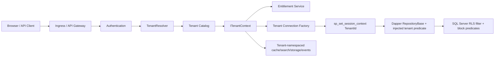

# Technical Design - Tenant Catalog and Row-Level Security

Feature Name: Tenant Catalog and Isolation
Requirement ID: FR-015
Module: Platform / Core
Owner: Solution Architect
Created Date: 2026-06-14
Last Updated: 2026-06-27
Version: 1.1
Status: Approved

> Doc 2 of 5 required before implementation. Companion docs:
> FEAT-TENANT-001, DB-DESIGN-TENANT-001, UI-TENANT-001, TEST-TENANT-001.
> No Tenant Catalog or RLS implementation may start until all five documents are Approved.

---

# 1. Purpose

This document defines the implementation design for tenant resolution, tenant catalog
access, shard/placement routing, repository-injected tenant predicates (ADR-037), SQL Server RLS enforcement,
tenant lifecycle operations, and tenant-aware infrastructure namespaces.

The design implements approved ADR-005, ADR-006, DB-DESIGN-TENANT-001, and
SEC-DESIGN-001.

---

# 2. Architecture Summary



Tenant context is established before application services run. Data access is blocked unless
the tenant context has been resolved, authorized, and applied to the database connection.

---

# 3. Core Components

| Component | Responsibility |
|---|---|
| `TenantResolver` | Resolves candidate tenant from validated JWT claims, approved host/domain mapping, and user membership. |
| `TenantCatalogClient` | Reads tenant status, placement, shard, region, entitlements, provider references, and branding metadata. |
| `TenantContextMiddleware` | Builds and attaches `ITenantContext` to the request scope. |
| `ITenantContext` | Immutable request-scoped tenant object containing tenant ID, code, status, region, shard, placement, and entitlements. |
| `TenantConnectionFactory` | Resolves the physical connection and sets SQL session context before any query. |
| `TenantDbConnectionInterceptor` | Enforces session-context setup and validates current tenant context on opened connections. |
| `RepositoryBase` / `ISqlBuilder` | Applies the injected tenant + soft-delete predicate and tenant write stamping (ADR-037). |
| `TenantEntitySaveChangesInterceptor` | Injects `TenantId` on writes and blocks mismatched tenant writes before database call. |
| `EntitlementService` | Evaluates tenant feature/module flags for API, UI, job, report, event, and integration access. |
| `TenantLifecycleService` | Manages provision, activate, suspend, offboard, export, purge initiation, and placement change workflow. |
| `TenantNamespaceService` | Generates tenant-safe namespaces for Redis, search, blob/object storage, events, logs, and telemetry. |
| `SystemTenantContextRunner` | Runs background jobs under explicit audited tenant context. |

---

# 4. Tenant Resolution Rules

Tenant resolution uses multiple signals, but only trusted and validated signals become the
authoritative tenant context.

Resolution priority:

1. Validated token tenant claim for authenticated tenant-user requests.
2. Validated token plus selected tenant membership for users who belong to multiple tenants.
3. Approved host/domain mapping for routing, validated against token membership.
4. Platform-owner explicit tenant selection for platform administration APIs.
5. Explicit system tenant context for background jobs and maintenance tasks.

Rejected inputs:

- Tenant ID in request body.
- Tenant ID in query string as proof of access.
- Tenant ID in custom header from browser-originated traffic.
- Host/domain alone without authorization validation.
- Any tenant context for suspended/offboarding-blocked tenants unless platform maintenance
  permission allows it.

Failure behavior:

- Missing tenant context: 401 or 403.
- Ambiguous tenant context: 409 with tenant selection guidance where allowed.
- Suspended tenant: 403 with suspended tenant code.
- Unknown tenant: 404 for tenant-user flows, 403/404 according to platform policy.

---

# 5. Request Pipeline

1. Correlation ID is created or validated.
2. Authentication validates token signature, issuer, audience, expiry, and scopes.
3. Tenant resolver determines candidate tenant.
4. Tenant catalog loads tenant status, shard, region, placement, and entitlements.
5. Authorization validates the authenticated principal is allowed to operate in that tenant.
6. Request-scoped `ITenantContext` is created and made immutable.
7. Application service executes.
8. Data access opens tenant-scoped connection and sets `SESSION_CONTEXT('TenantId')`.
9. The repository-injected tenant predicate and SQL Server RLS apply.
10. Audit and telemetry include tenant context.

No application service may access tenant-scoped repositories without `ITenantContext`.

---

# 6. Database Connection and Session Context

The connection factory must:

- Resolve database placement from catalog.
- Open a connection only through approved factory methods.
- Execute `sp_set_session_context` with the resolved `TenantId` before the first tenant
  query.
- Set the context on every opened connection because connection pooling can reuse physical
  connections.
- Validate the effective session context after setting it in test and diagnostic modes.
- Disable unsafe multi-tenant reuse of one `DbContext` or transaction.
- Keep MARS disabled unless a specific reviewed exception exists.

Guidance:

- Do not set session context from client input.
- Do not rely only on the app-layer predicate; RLS is the backstop.
- Do not run tenant-scoped SQL before session context is set.
- Do not use raw SQL paths except through reviewed repository methods that preserve tenant
  context.

---

# 7. Repository-Injected Tenant Predicate (Dapper)

> Per **ADR-037**, the app-layer tenant filter is enforced by a central Dapper
> `RepositoryBase`/SQL-builder, not an EF Core global query filter. RLS (§8) remains the
> database-level backstop; the outcomes below are unchanged.

Every tenant-scoped entity implements the tenant marker interface:

```csharp
public interface ITenantScopedEntity
{
    Guid TenantId { get; }
}
```

The `RepositoryBase`/`ISqlBuilder` must apply tenant + soft-delete filtering consistently to
every tenant-scoped query. Conceptually the generated `WHERE` always begins with:

```sql
WHERE [TenantId] = @__tenantId AND [IsDeleted] = 0
```

where `@__tenantId` is bound from `ITenantContext` (never a caller parameter), and any
developer-supplied filter is `AND`-appended afterwards.

Rules:

- The mandatory predicates apply to all tenant-scoped root entities and are emitted by the
  builder, not by the caller — there is no per-query developer discretion.
- Soft-delete and tenant predicates are always combined.
- There is no supported API to build a tenant-scoped query without the tenant predicate.
- Any cross-tenant platform operation requires an explicit, reviewed path, security review, and
  audit event.
- Only `HRMS.Platform.Data` may issue Dapper/raw SQL; an architecture test enforces this so the
  repository base is the only way to build tenant-scoped SQL.

---

# 8. SQL Server RLS Enforcement

RLS is mandatory for every tenant-scoped table.

Design requirements:

- Use a dedicated security schema for predicate functions and policies.
- Use filter predicates to hide rows from other tenants.
- Use block predicates to prevent writes for the wrong tenant.
- Avoid implicit conversions in predicate functions.
- Avoid recursion and excessive joins in predicate functions.
- Apply RLS to temporal/history tables where used.
- Audit and restrict changes to RLS functions and policies.

Predicate model:

```sql
CREATE FUNCTION security.fn_tenant_predicate(@TenantId uniqueidentifier)
RETURNS TABLE
WITH SCHEMABINDING
AS
RETURN SELECT 1 AS ok
WHERE @TenantId = CAST(SESSION_CONTEXT(N'TenantId') AS uniqueidentifier);
```

Security policy model:

```sql
CREATE SECURITY POLICY security.TenantIsolation
ADD FILTER PREDICATE security.fn_tenant_predicate(TenantId) ON <schema>.<table>,
ADD BLOCK PREDICATE security.fn_tenant_predicate(TenantId) ON <schema>.<table>
WITH (STATE = ON);
```

The final SQL must be reviewed against DB-DESIGN-TENANT-001 and database standards before
implementation.

---

# 9. Catalog and Cache Design

The catalog database is the control plane. It is not tenant-scoped in the same way as
business data because it defines tenants and placements.

Catalog access rules:

- Read access through `TenantCatalogClient`.
- Mutations through `TenantLifecycleService` only.
- Platform-owner role required for tenant lifecycle, placement, provider, and plan changes.
- Redis cache allowed for tenant lookup, with short TTL and event-based invalidation.
- Suspended/offboarding status must be refreshed safely; stale active cache cannot override
  known suspended state.
- Secret values are never stored or returned; only secret references are used.

Catalog invalidation events:

- `TenantProvisioned`
- `TenantActivated`
- `TenantSuspended`
- `TenantOffboardingStarted`
- `TenantPlacementChanged`
- `TenantEntitlementsChanged`
- `TenantBrandingChanged`
- `TenantProviderConfigChanged`

---

# 10. Tenant Lifecycle Services

## 10.1 Provision

Provisioning creates catalog metadata, assigns placement, seeds default entitlement and
configuration versions, and emits audit/events. Business module tables are not seeded here
unless their approved feature docs require it.

## 10.2 Activate

Activation requires:

- Catalog record valid.
- Placement reachable.
- Required database migrations complete.
- Initial tenant admin identity configured.
- Required entitlements present.
- Audit record written.

## 10.3 Suspend

Suspension blocks:

- Tenant user login and API calls.
- Tenant scheduled jobs.
- Tenant integrations.
- Tenant reports.
- Tenant AI paths.

Platform-owner maintenance flows remain available only with elevated permission and audit.

## 10.4 Offboard

Offboarding coordinates:

- Access block.
- Export where permitted.
- Legal-hold check.
- Retention and purge request.
- Search/cache/blob/vector cleanup tasks where applicable.
- Final evidence record.

## 10.5 Placement Change

Placement change updates routing after migration evidence is complete. Routing uses catalog
indirection, so application code remains unchanged.

---

# 11. Entitlements and Feature Flags

Entitlements are evaluated centrally.

Enforcement points:

- API authorization.
- UI navigation and page access.
- Background jobs.
- Event consumers.
- Reports and exports.
- Integrations and provider adapters.
- AI and search features.

Feature flags are not authorization by themselves. A user must still pass RBAC and ABAC.

---

# 12. Namespacing Requirements

The tenant namespace service must generate keys or scopes for:

- Redis keys.
- Search indexes and aliases.
- Blob/object storage paths.
- Event routing keys.
- OpenTelemetry attributes after privacy review.
- Audit records.
- Provider configuration lookup.
- AI vector/cache namespaces.

No shared mutable key may omit tenant scope.

---

# 13. Background Jobs

Background jobs must not run without explicit tenant context.

Rules:

- Jobs are scheduled per tenant or execute tenant batches one tenant at a time.
- Each tenant execution sets `ITenantContext`.
- Each database connection sets SQL session context.
- Each tenant iteration has separate audit/correlation ID.
- A suspended tenant is skipped unless the job type is platform maintenance and explicitly
  allowed.
- Cross-tenant aggregate jobs use read models or platform workflows designed for that
  purpose, not ordinary tenant repositories.

---

# 14. Security and Abuse Controls

- Enforce RBAC and ABAC before tenant lifecycle or catalog mutation.
- Validate object-level authorization for every tenant ID and resource ID.
- Use random, non-sequential IDs for externally visible tenant-scoped resources where
  practical.
- Audit denied tenant access attempts.
- Alert on repeated tenant mismatch, RLS policy modification, cache namespace collisions,
  and suspicious platform-owner actions.
- Deny direct database access for application identities except through least-privilege
  roles required by the app.

---

# 15. Observability

Metrics:

- Tenant resolution latency.
- Catalog cache hit/miss.
- RLS blocked write count.
- Tenant mismatch denial count.
- Suspended tenant access attempt count.
- Entitlement denial count.
- Placement lookup latency.
- Background job tenant execution count.

Logs and traces:

- Include tenant ID only where approved and never expose tenant secrets.
- Include correlation ID.
- Redact user PII and secrets.
- Mark platform-owner lifecycle actions clearly.

---

# 16. OpenAPI Requirements

Tenant APIs must be added to or verified against the approved foundational OpenAPI package
before implementation.

Required endpoint groups:

- Tenant registry.
- Tenant detail.
- Tenant provisioning.
- Tenant lifecycle actions.
- Tenant entitlements.
- Tenant branding/domains.
- Tenant placement.
- Tenant isolation evidence.

---

# 17. Degraded Modes

| Failure | Behavior |
|---|---|
| Catalog unavailable and no safe cache | Tenant request fails closed. |
| Catalog unavailable with safe active cache | Read-only tenant flow may continue if policy allows; lifecycle mutation blocked. |
| Redis cache unavailable | Resolve from catalog DB; continue if catalog is available. |
| Placement database unavailable | Tenant-specific service unavailable; other tenants unaffected where placement isolation allows. |
| Session context setup fails | Tenant-scoped data access fails closed. |
| RLS policy disabled or missing | Health check fails; deployment blocked. |

---

# 18. Acceptance Criteria

| ID | Criterion |
|---|---|
| TECH-TENANT-AC-001 | Request pipeline creates immutable server-side `ITenantContext` before application services execute. |
| TECH-TENANT-AC-002 | Tenant context can be resolved from validated token/host mapping but is never trusted from request body. |
| TECH-TENANT-AC-003 | Connection factory sets SQL session context on every tenant-scoped connection before first query. |
| TECH-TENANT-AC-004 | The repository-injected tenant predicate applies to all tenant-scoped entities; no supported API builds a tenant-scoped query without it (ADR-037). |
| TECH-TENANT-AC-005 | SQL RLS filter and block predicates protect every tenant-scoped table. |
| TECH-TENANT-AC-006 | Raw SQL outside `HRMS.Platform.Data`, any predicate-bypass, and platform cross-tenant paths are blocked (architecture test) or explicitly audited exceptions. |
| TECH-TENANT-AC-007 | Suspended tenant status blocks user APIs, jobs, integrations, reports, AI, and tenant-scoped workflows. |
| TECH-TENANT-AC-008 | Tenant placement changes route through catalog without application code change. |
| TECH-TENANT-AC-009 | Entitlements are enforced across API, UI, jobs, reports, integrations, and events. |
| TECH-TENANT-AC-010 | Cache, search, storage, event, telemetry, and provider namespaces include tenant scope. |
| TECH-TENANT-AC-011 | Background jobs run under explicit audited tenant context. |
| TECH-TENANT-AC-012 | Tenant lifecycle changes emit audit records and invalidation events. |
| TECH-TENANT-AC-013 | Degraded catalog, cache, or session-context behavior fails closed when safety is uncertain. |
| TECH-TENANT-AC-014 | OpenAPI is updated for all tenant APIs before implementation. |
| TECH-TENANT-AC-015 | Automated tests prove the technical design prevents cross-tenant leakage. |
| TECH-TENANT-AC-016 | Branch / Office Hierarchy and Scoped Administration is enforced as a tenant-internal ABAC boundary. |

---

# 18.1 Phase 7A Branch / Office Addendum

Tenant implementation must comply with
`docs/09-development/TECH-BRANCH-001-technical-design.md`. Branches/offices are not child
tenants. They are tenant-owned organizational scopes used by Identity, Core HR,
Attendance, Leave, Payroll, Reports, Audit, jobs, exports, workflows, and AI retrieval.

---

# 19. Official and Primary References

- Microsoft SQL Server Row-Level Security:
  `https://learn.microsoft.com/en-us/sql/relational-databases/security/row-level-security`
- Microsoft SQL Server `SESSION_CONTEXT`:
  `https://learn.microsoft.com/en-us/sql/t-sql/functions/session-context-transact-sql`
- Microsoft SQL Server `sp_set_session_context`:
  `https://learn.microsoft.com/en-us/sql/relational-databases/system-stored-procedures/sp-set-session-context-transact-sql`
- Microsoft EF Core Global Query Filters:
  `https://learn.microsoft.com/en-us/ef/core/querying/filters`
- Microsoft Azure Architecture Center - tenant request mapping:
  `https://learn.microsoft.com/en-us/azure/architecture/guide/multitenant/considerations/map-requests`
- Microsoft Azure Architecture Center - tenancy models:
  `https://learn.microsoft.com/en-us/azure/architecture/guide/multitenant/considerations/tenancy-models`
- OWASP API1:2023 Broken Object Level Authorization:
  `https://owasp.org/API-Security/editions/2023/en/0xa1-broken-object-level-authorization/`
- NIST SP 800-207 Zero Trust Architecture:
  `https://csrc.nist.gov/pubs/sp/800/207/final`

References last validated: 2026-06-27.

---

# Approval

Product Owner: Approved by Bhajan Lal 2026-06-27  
Solution Architect: Approved as part of owner-approved Tenant Catalog + RLS package 2026-06-27  
.NET Architect: Approved as part of owner-approved Tenant Catalog + RLS package 2026-06-27  
Security Architect: Approved as part of owner-approved Tenant Catalog + RLS package 2026-06-27  
Database Architect: Approved as part of owner-approved Tenant Catalog + RLS package 2026-06-27  
QA Architect: Approved as part of owner-approved Tenant Catalog + RLS package 2026-06-27

(Status: Approved - owner approved 2026-06-27)
